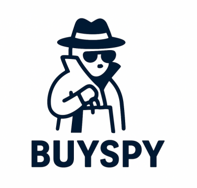

# BuySpy - Your Personal AI Shopping Concierge 🛍️🤖

<div align="center">
  
</div>
# BuySpy - Your Personal AI Shopping Concierge 🛍️🤖

BuySpy is an AI-powered shopping assistant, built as a capstone project. It acts as a personal concierge via a Telegram chat, helping users find, research, and compare products in a personalized and localized way.

This project is built using Google's Agent Development Kit (ADK) and demonstrates a multi-agent system that can search for both new and used items, remember user preferences, analyze reviews, and provide curated recommendations.

## ✨ Features

-   **Conversational Interface:** Chat with BuySpy naturally on Telegram.
-   **Personalization:** Remembers your name, size, and favorite brands.
-   **Localized Search:** Tailors results to your country.
-   **New & Used Items:** Searches Google for new items and local marketplaces (like Tori.fi) for used ones.
-   **Review Vetting:** Summarizes product reviews and checks vendor ratings using the Google Places API to build trust.
-   **Comparison Summaries:** Generates easy-to-read tables comparing product options.

## 🛠️ Tech Stack

-   **Backend:** Python 3.11+, FastAPI
-   **AI/Agent Framework:** Google Agent Development Kit (ADK)
-   **LLM:** Google Gemini (via Vertex AI)
-   **Interface:** `python-telegram-bot` (using polling)
-   **Cloud Services:**
    -   Google Cloud Firestore (for long-term memory)
    -   Google Cloud Translation API
    -   Google Places API
-   **Dependency Management:** uv
-   **Local Testing:** Streamlit Playground
-   **Infrastructure:** Terraform (for Google Cloud deployment)

## 📁 Project Structure

```
buyspy/
├── app/                 # Core application code
│   ├── agent.py         # Main agent logic
│   ├── agent_engine_app.py # Agent Engine application logic
│   └── app_utils/       # App utilities and helpers
├── .github/             # CI/CD pipeline configurations for GitHub Actions
├── deployment/          # Infrastructure and deployment scripts
├── notebooks/           # Jupyter notebooks for prototyping and evaluation
├── tests/               # Unit, integration, and load tests
├── Makefile             # Makefile for common commands
├── GEMINI.md            # AI-assisted development guide
└── pyproject.toml       # Project dependencies and configuration
```

## 🚀 Getting Started

### Prerequisites

-   **uv**: Python package manager - [Install](https://docs.astral.sh/uv/getting-started/installation/)
-   **Google Cloud SDK**: For authenticating to GCP services - [Install](https://cloud.google.com/sdk/docs/install)
-   **make**: Build automation tool (pre-installed on most Unix-based systems)
-   **Terraform**: For infrastructure deployment - [Install](https://developer.hashicorp.com/terraform/downloads)
-   **Docker & Docker Compose** (optional, for containerized deployment): [Install Docker](https://docs.docker.com/get-docker/)
-   A Telegram Bot Token from BotFather.
-   A Google Cloud Project with billing enabled.

### Installation & Setup

1.  **Clone the repository:**
    ```bash
    git clone https://github.com/<your-username>/buyspy.git
    cd buyspy
    ```

2.  **Authenticate with Google Cloud:**
    Log in with the gcloud CLI and set up Application Default Credentials. This allows the application to securely access Google Cloud APIs.
    ```bash
    gcloud auth login
    gcloud auth application-default login
    ```

3.  **Enable GCP APIs:**
    In your Google Cloud project, make sure you have enabled the following APIs:
    -   Vertex AI API
    -   Cloud Translation API
    -   Places API

4.  **Configure Environment Variables:**
    Create a `.env` file in the root directory by copying the example file:
    ```bash
    cp .env.example .env
    ```
    Now, fill in the values in your `.env` file:
    ```env
    # Google Cloud (for services like Firestore, Translate, Vertex AI)
    GCP_PROJECT_ID="your-gcp-project-id"
    GCP_REGION="your-gcp-region" # e.g., europe-west1

    # Telegram
    TELEGRAM_BOT_TOKEN="your-telegram-bot-token"
    ```

5.  **Install dependencies:**
    This command uses `uv` to install all necessary packages listed in `pyproject.toml`.
    ```bash
    make install
    ```

### Local Development

This project uses two main components for local development: the ADK agent server (tested via a Streamlit playground) and a separate Telegram polling script.

1.  **Run the Agent Playground:**
    In one terminal, launch the Streamlit interface to interact with and test your agent directly. The server will auto-reload on code changes in the `app/` directory.
    ```bash
    make playground
    ```

2.  **Run the Telegram Bot:**
    In a second terminal, run the Telegram polling script. This script will fetch messages from Telegram, send them to your local agent server, and return the agent's response to the user.
    ```bash
    uv run python scripts/run_telegram_bot.py
    ```
    You can now interact with your agent by messaging your bot on Telegram.

## ⚙️ Available Commands

| Command              | Description                                                                                 |
| -------------------- | ------------------------------------------------------------------------------------------- |
| `make install`       | Install all required dependencies using uv                                                  |
| `make playground`    | Launch Streamlit interface for testing agent locally and remotely |
| `make deploy`        | Deploy agent to Agent Engine |
| `make register-gemini-enterprise` | Register deployed agent to Gemini Enterprise |
| `make test`          | Run unit and integration tests                                                              |
| `make lint`          | Run code quality checks (codespell, ruff, mypy)                                             |
| `make setup-dev-env` | Set up development environment resources using Terraform                         |
| `docker-compose up --build` | Build and run the bot in Docker containers |
| `docker-compose down` | Stop the Docker containers |

For full command options and usage, refer to the [Makefile](Makefile).

## 🧪 Testing

### Overview
This project includes a comprehensive testing setup with unit tests, integration tests, and automated code quality checks to ensure code reliability, maintainability, and adherence to best practices.

### Running Tests
Run tests using the following commands:

- **All tests:** `make test`
- **Unit tests only:** `uv run pytest tests/unit/ -v`
- **Integration tests only:** `uv run pytest tests/integration/ -v`
- **Specific test files:** `uv run pytest tests/unit/test_config.py -v`

### Code Quality
Ensure code quality with automated linting and type checking:

- **All linters:** `make lint`
- **Ruff (linting and formatting):** `uv run ruff check .`
- **MyPy (type checking):** `uv run mypy .`
- **Codespell (spell checking):** `uv run codespell`

### Pre-commit Hooks
Pre-commit hooks are configured to automatically run code quality checks before each commit:

- **Installed hooks:** ruff, mypy, codespell, pytest
- **Install hooks:** `uv run pre-commit install`
- **Run hooks manually:** `uv run pre-commit run --all-files`
- **Skip hooks (emergencies only):** `git commit --no-verify`

### Test Coverage
The test suite covers key components:

- **Config module:** Settings validation and environment variable handling
- **Dependencies module:** Dependency injection and service initialization
- **Telegram service:** Message handling, error handling, and API interactions
- **Integration tests:** End-to-end flows including agent communication and external API calls

## 📊 Test Status

*Test status badges will be added here once CI/CD integration is complete.*

## 🔄 Development Process

This project follows a structured development approach:

1. **Prototype:** Build your BuySpy AI agent using the intro notebooks in `notebooks/` for guidance. Use Vertex AI Evaluation to assess performance.
2. **Integrate:** Customize your agent logic by editing `app/agent.py` to implement shopping concierge features.
3. **Test:** Explore your agent functionality using the Streamlit playground with `make playground`. The playground offers features like chat history, user feedback, and various input types, and automatically reloads your agent on code changes.
4. **Deploy:** Set up and initiate the CI/CD pipelines, customizing tests as necessary. For streamlined infrastructure deployment, simply run `make setup-dev-env` or `uvx agent-starter-pack setup-cicd`.
5. **Monitor:** Track performance and gather insights using Cloud Logging, Tracing, and the Looker Studio dashboard to iterate on your application.

## 🚀 Deployment Options

### Docker Deployment (Local)

The application can be easily deployed locally using Docker and Docker Compose.

#### Prerequisites for Docker Deployment

- **Docker & Docker Compose**: [Install Docker](https://docs.docker.com/get-docker/)
- **Environment Configuration**: Create your `.env` file as described in the Installation section

#### Quick Start with Docker

1. **Clone and setup the project:**
    ```bash
    git clone https://github.com/<your-username>/buyspy.git
    cd buyspy
    cp .env.example .env
    # Edit .env with your configuration
    ```

2. **Build and run with Docker Compose:**
    ```bash
    docker-compose up --build
    ```

The bot will start automatically and begin polling for Telegram messages.

#### Docker Commands

| Command | Description |
|---------|-------------|
| `docker-compose up --build` | Build and start the bot |
| `docker-compose up -d` | Run in background |
| `docker-compose down` | Stop the bot |
| `docker-compose logs -f buyspy-bot` | View logs |
| `docker-compose restart buyspy-bot` | Restart the bot |

### Google Cloud Deployment

For streamlined deployment to Google Cloud Platform:

#### One-Command Deployment
For a streamlined one-command deployment of the entire CI/CD pipeline and infrastructure using Terraform:
```bash
uvx agent-starter-pack setup-cicd
```
Currently supports GitHub with both Google Cloud Build and GitHub Actions as CI/CD runners.

#### Manual Deployment

**Dev Environment:**
```bash
gcloud config set project <your-dev-project-id>
make deploy
```

**Production Deployment:**
The repository includes a comprehensive Terraform configuration for production deployment. See [deployment/README.md](deployment/README.md) for detailed instructions on how to deploy the infrastructure and application.

## 📊 Monitoring and Observability

The application uses OpenTelemetry for comprehensive observability with all events being sent to:
- **Google Cloud Trace and Logging** for real-time monitoring
- **BigQuery** for long-term storage and analysis

You can use [this Looker Studio dashboard](https://lookerstudio.google.com/reporting/46b35167-b38b-4e44-bd37-701ef4307418/page/tEnnC) template for visualizing events being logged in BigQuery. See the "Setup Instructions" tab to get started.
