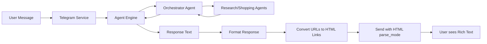

# Enhanced Orchestrator Output with Emojis & Rich Text

## 📋 Overview

This document outlines the implementation plan for enhancing the BuySpy bot's user experience by:
1. Adding creative emojis throughout the orchestrator's responses
2. Implementing HTML formatting in Telegram for clickable links and rich text
3. Making the output more visually appealing and user-friendly

## 🎯 Goals

- Keep text-based output (no JSON structure changes)
- Add emojis consistently throughout responses
- Convert raw URLs to clickable, readable links
- Use HTML formatting for better visual hierarchy
- Maintain backward compatibility with existing functionality

## 🏗️ Architecture Changes



## 📝 Detailed Changes

### 1. Orchestrator Agent Enhancement

**File:** [`app/subagents/orchestrator/agent.py`](../app/subagents/orchestrator/agent.py)

**Changes to instruction:**
- Add emoji usage guidelines for different contexts
- Encourage creative, friendly communication
- Specify when to use which emojis

**Emoji Strategy:**

| Context | Emoji | Usage |
|---------|-------|-------|
| Country/Location | 🌍 | When asking about or mentioning country |
| Research/Search | 🔍 | During research phase |
| Pricing | 💰 | When showing prices |
| In Stock | ✅ | Product available |
| Limited Availability | ⚠️ | Low stock |
| Out of Stock | ❌ | Not available |
| Tier 1 Stores | ⭐ | Official, local major retailers |
| Tier 2 Stores | 🌟 | International with country sites |
| Tier 3 Stores | 💫 | Generic international |
| Recommendations | 🎯 | Top picks |
| Comparisons | 📊 | When comparing products |
| Tips/Notes | 💡 | Helpful information |
| Shopping | 🛒 | General shopping context |

**Example Enhanced Output:**

```
🌍 Which country are you shopping in?

🔍 Research Results for Finland

🎯 Top Recommendations:

1. ⭐ Sony WH-CH520
   💡 Best value for wireless headphones

2. ⭐ JBL Tune 510BT
   💡 Great battery life and comfort

Would you like me to find prices for these? 💰
```

### 2. Telegram Service Enhancement

**File:** [`app/services/telegram_service.py`](../app/services/telegram_service.py)

#### Key Discovery: Built-in HTML Support! 🎉

The python-telegram-bot library has **built-in methods** for HTML formatting:
- `reply_html()` - Automatically sets `parse_mode='HTML'`
- `reply_markdown()` - For Markdown formatting
- `reply_markdown_v2()` - For MarkdownV2 formatting

**This means we DON'T need custom formatting helpers!**

#### Simplified Changes:

##### a. Use Built-in `reply_html()` Method

```python
# In handle_message method, change from:
await update.message.reply_text(response_text)

# To:
await update.message.reply_html(
    response_text,
    disable_web_page_preview=False  # Show link previews
)
```

That's it! The library handles:
- HTML parsing automatically
- Proper escaping of special characters
- Link formatting with `<a href="url">text</a>`
- Bold with `<b>text</b>`
- Italic with `<i>text</i>`

##### b. Optional: Add URL Conversion Helper (if needed)

Only if we want to convert raw URLs to clickable links with custom text:

```python
import re
from urllib.parse import urlparse

def _convert_urls_to_links(self, text: str) -> str:
    """Convert raw URLs to HTML links with store names.

    Converts:
        https://verkkokauppa.com/fi/product/123
    To:
        <a href="https://verkkokauppa.com/fi/product/123">Verkkokauppa</a>

    Args:
        text: Text containing raw URLs

    Returns:
        Text with URLs converted to HTML links
    """
    url_pattern = r'https?://[^\s<>"{}|\\^`\[\]]+'

    def replace_url(match):
        url = match.group(0)
        # Extract store name from domain
        domain = urlparse(url).netloc.replace('www.', '')
        store_name = domain.split('.')[0].capitalize()
        return f'<a href="{url}">{store_name}</a>'

    return re.sub(url_pattern, replace_url, text)
```

Then use it before sending:

```python
formatted_text = self._convert_urls_to_links(response_text)
await update.message.reply_html(formatted_text)
```

### 3. Response Formatting Logic

**HTML Formatting Rules:**
- `<b>Bold</b>` for product names, prices, headers
- `<i>Italic</i>` for reasons, notes, descriptions
- `<a href="URL">Link Text</a>` for clickable links
- `<code>Code</code>` for technical details if needed
- Preserve emojis as-is (they work in HTML)
- Escape special HTML characters: `&`, `<`, `>` (except in our tags)

**Link Formatting Strategy:**

The orchestrator will output URLs in context, and the telegram service will convert them:

```
Before: 49.99 EUR - Verkkokauppa - In Stock - https://verkkokauppa.com/fi/product/123
After:  49.99 EUR - <a href="https://verkkokauppa.com/fi/product/123">Verkkokauppa</a> - In Stock
```

## 🔄 Implementation Steps (Simplified!)

### Step 1: Update Orchestrator Instructions
- Add emoji guidelines to instruction text
- Encourage creative, friendly tone with HTML formatting
- Specify emoji usage for different contexts
- Add HTML formatting examples (`<b>`, `<i>`, `<a>`)
- Instruct agent to format URLs as `<a href="url">Store Name</a>`

### Step 2: Update Telegram Service (Minimal Changes!)
- Change `reply_text()` to `reply_html()` in `handle_message()`
- Optionally add `_convert_urls_to_links()` helper if agent doesn't format URLs
- That's it! No manual HTML escaping needed - library handles it

### Step 3: Test with Sample Responses
- Test emoji rendering
- Test HTML formatting (bold, italic, links)
- Test URL clickability
- Test error cases (malformed HTML, special characters)
- Test message length limits (4096 chars for Telegram)

### Step 4: Update Tests
- Update existing tests to use `reply_html()` instead of `reply_text()`
- Add tests for URL conversion helper (if implemented)
- Test edge cases:
  - No URLs in response
  - Multiple URLs
  - Special characters in text
  - Very long URLs

## 📊 Example Before/After

### Before:
```
Product: Sony WH-CH520
Why: Best value for wireless headphones
Best Prices:
1. 49.99 EUR - Verkkokauppa - In Stock - https://verkkokauppa.com/fi/product/123
2. 52.90 EUR - Amazon - In Stock - https://amazon.fi/dp/ABC123
Total Found: 5
```

### After:
```
🎯 <b>Sony WH-CH520</b>
💡 <i>Best value for wireless headphones</i>

💰 <b>Best Prices:</b>

1. ⭐ <b>49.99 EUR</b> - <a href="https://verkkokauppa.com/fi/product/123">Verkkokauppa</a>
   ✅ In Stock

2. 🌟 <b>52.90 EUR</b> - <a href="https://amazon.fi/dp/ABC123">Amazon</a>
   ✅ In Stock

📊 Total Found: 5 stores
```

## 🧪 Testing Strategy

### Unit Tests

**File:** `tests/unit/services/test_telegram_service.py`

```python
def test_convert_urls_to_links():
    """Test URL to HTML link conversion (if helper is implemented)."""
    text = "Check https://verkkokauppa.com/fi/product/123 for price"
    result = service._convert_urls_to_links(text)
    assert '<a href="https://verkkokauppa.com/fi/product/123">Verkkokauppa</a>' in result

def test_handle_message_uses_html():
    """Test that handle_message uses reply_html for formatting."""
    # Mock the update and context
    # Verify reply_html is called instead of reply_text
    pass
```

### Integration Tests

**File:** `tests/integration/test_telegram_integration.py`

- Test full message flow with HTML formatting
- Verify Telegram accepts the HTML
- Test with real agent responses
- Test error handling with malformed HTML

### Manual Testing Checklist

- [ ] Send test message to bot
- [ ] Verify links are clickable
- [ ] Verify emojis render correctly on mobile
- [ ] Verify emojis render correctly on desktop
- [ ] Check formatting with long responses
- [ ] Test with multiple products
- [ ] Test with no URLs in response
- [ ] Test with special characters in product names

## ⚠️ Risks & Mitigations

| Risk | Impact | Mitigation |
|------|--------|------------|
| HTML injection from agent output | High | Escape all HTML except our formatted tags using `html.escape()` |
| Malformed URLs breaking formatting | Medium | Use robust regex, handle exceptions, fallback to original text |
| Telegram HTML limits (4096 chars) | Medium | Keep responses concise, split long messages if needed |
| Emoji rendering issues | Low | Use standard Unicode emojis, test on multiple devices |
| URL regex false positives | Low | Use strict URL pattern, validate with urlparse |
| Breaking existing functionality | Medium | Comprehensive testing, gradual rollout |

## ✅ Success Criteria

- [ ] Orchestrator uses emojis consistently and creatively
- [ ] All URLs are clickable links with readable names
- [ ] Text formatting (bold, italic) works correctly
- [ ] No HTML injection vulnerabilities
- [ ] All existing tests pass
- [ ] New formatting tests added and passing
- [ ] Manual testing shows improved UX
- [ ] Response time not significantly impacted
- [ ] Works on both mobile and desktop Telegram clients

## 🔧 Technical Details

### Built-in Library Features

The python-telegram-bot library provides:
- `reply_html()` - Automatically handles HTML parsing and escaping
- `reply_markdown()` - For Markdown formatting
- `reply_markdown_v2()` - For MarkdownV2 formatting

**No manual HTML escaping needed!** The library handles it automatically.

### URL Pattern (for optional helper)

```python
# Match URLs but avoid common false positives
URL_PATTERN = r'https?://[^\s<>"{}|\\^`\[\]]+'
```

### Telegram HTML Limitations

- Maximum message length: 4096 characters
- Supported tags: `<b>`, `<i>`, `<a>`, `<code>`, `<pre>`, `<s>`, `<u>`, `<tg-spoiler>`
- Links must have valid href attribute
- No nested formatting of same type
- Emojis work natively (no special handling needed)

## 📚 References

- [Telegram Bot API - Formatting Options](https://core.telegram.org/bots/api#formatting-options)
- [Python HTML Escaping](https://docs.python.org/3/library/html.html)
- [URL Regex Patterns](https://urlregex.com/)
- [Emoji Unicode Standard](https://unicode.org/emoji/charts/full-emoji-list.html)

## 🚀 Deployment Plan

1. **Development**: Implement changes in feature branch
2. **Testing**: Run all tests, manual testing
3. **Review**: Code review, security review
4. **Staging**: Deploy to test environment
5. **Production**: Gradual rollout with monitoring

## 📝 Future Enhancements

- Add inline keyboard buttons for product selection
- Support for images in responses
- Rich cards for product comparisons
- User preferences for emoji density
- Customizable link text format
