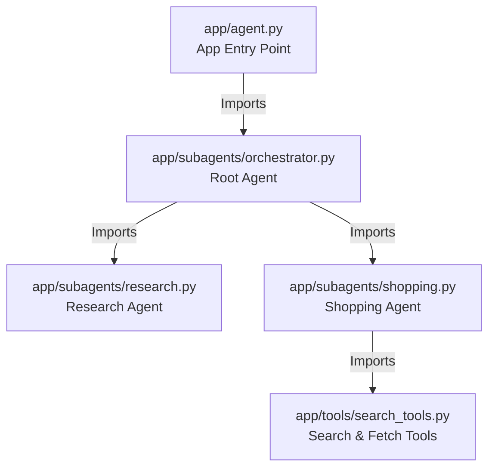

# Refactoring Plan: Modular Agent Architecture (Split Specialists)

## 1. Executive Summary & Goals
- **Objective:** Restructure the monolithic `agent.py` into a modular architecture aligned with the "Future Plans" design, while explicitly splitting "specialist" agents into their own files.
- **Goals:**
  1.  Refactor `agent.py` into `subagents/orchestrator.py`, `subagents/shopping.py`, and `subagents/research.py`.
  2.  Consolidate tool definitions (Link Finder & MCP Fetch) into `app/tools/search_tools.py`.
  3.  **Crucial:** Ensure all agents (`root`, `shopping`, `research`) are instantiated as global variables in their respective modules to support ADK Web loading.

## 2. Proposed Solution / Refactoring Strategy

### 3.1. High-Level Design / Architectural Overview
The system will be decomposed into specialized modules. Each module is responsible for instantiating its specific agent globally.

### 3.2. Key Components
1.  **`app/tools/search_tools.py`**: Merges the existing `link_finder.py` logic with the MCP `fetch` tool definition.
2.  **`app/subagents/shopping.py`**: Dedicated file for the Price Verification Engine (Shopping Agent).
3.  **`app/subagents/research.py`**: Dedicated file for the Regional Product Research Specialist (Research Agent).
4.  **`app/subagents/orchestrator.py`**: The "Brain" (Root Agent) that coordinates the subagents.
5.  **`app/agent.py`**: The minimal entry point that initializes the `App` object.

### 3.3. Detailed Action Plan / Phases

#### Phase 1: Tooling Infrastructure
*   **Priority:** High
*   **Objective:** Centralize tool definitions to be shared by agents.

*   **Task 1.1: Create/Refactor `app/tools/search_tools.py`**
    *   **Rationale:** The "Future Plans" structure specifies `search_tools.py`.
    *   **Action:**
        *   Move the contents of `app/tools/link_finder.py` (`find_shopping_links`) into this file.
        *   Move the `_get_fetch_tool` logic from `agent.py` into this file.
        *   **Definition:** Instantiate `fetch_tool` as a global variable (or keep as a simple factory if preferred, but global is easier for direct import).
    *   **Deliverable:** `search_tools.py` containing both `find_shopping_links` and `fetch_tool`.
    *   **Cleanup:** Delete `app/tools/link_finder.py` after migration.

#### Phase 2: Specialist Agents (Subagents)
*   **Priority:** High
*   **Objective:** specific files for specific agents.

*   **Task 2.1: Create `app/subagents/__init__.py`**
    *   Make it a package.

*   **Task 2.2: Create `app/subagents/research.py`**
    *   **Action:**
        *   Move `_create_research_agent` logic here.
        *   Move `current_year` calculation here.
        *   **Global Instantiation:** `research_agent = Agent(...)`.
    *   **Dependencies:** Imports `google_search` from `google.adk.tools`.

*   **Task 2.3: Create `app/subagents/shopping.py`**
    *   **Action:**
        *   Move `_create_shopping_agent` logic here.
        *   **Global Instantiation:** `shopping_agent = Agent(...)`.
    *   **Dependencies:** Imports `find_shopping_links` and `fetch_tool` from `app.tools.search_tools`.

#### Phase 3: Orchestrator & Root
*   **Priority:** High
*   **Objective:** Wire the specialists together.

*   **Task 3.1: Create `app/subagents/orchestrator.py`**
    *   **Action:**
        *   Move `_initialize_google_auth` here and execute it at module level.
        *   Import `research_agent` from `.research`.
        *   Import `shopping_agent` from `.shopping`.
        *   Move `_create_root_agent` logic here.
        *   **Global Instantiation:** `root_agent = Agent(..., tools=[AgentTool(research_agent), ...])`.

#### Phase 4: Composition Root
*   **Priority:** Medium
*   **Objective:** Finalize the entry point.

*   **Task 4.1: Update `app/agent.py`**
    *   **Action:**
        *   Import `root_agent` from `app.subagents.orchestrator`.
        *   Instantiate `app = App(root_agent=root_agent, ...)`.
        *   Remove all old code (agent definitions, tool setups).
    *   **Deliverable:** A minimal file connecting the `root_agent` to the `App`.

## 4. Key Considerations & Risk Mitigation

### 4.1. Technical Risks
-   **Circular Imports:** Splitting `orchestrator` (which uses subagents) from `subagents` (which are independent) prevents circular dependencies.
-   **Global Execution:** `_initialize_google_auth()` must run before `root_agent` is instantiated. Placing it at the top of `orchestrator.py` ensures this.

### 4.2. Dependencies
-   `app/tools/search_tools.py` becomes a shared dependency for the shopping agent.

## 5. Success Metrics
-   File structure exists: `app/subagents/{shopping.py, research.py, orchestrator.py}`.
-   `app/agent.py` contains < 20 lines of code (mostly imports).
-   `shopping_agent` is importable as `from app.subagents.shopping import shopping_agent`.
-   Functionality "Find price for X" remains unchanged.
